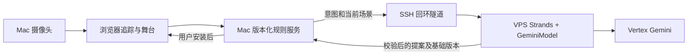

# Vertex + Strands 创作服务

CAST 使用 Strands 官方 `GeminiModel` 调用 Vertex，不使用关键词模板生成规则。模型只获得意图、当前规则和场景对象；工具校验后产生候选规则，安装仍由本地版本化接口执行。

## 同机运行

```sh
pip install -e '.[agent,test]'
export CAST_PROVIDER=vertex
export GOOGLE_CLOUD_PROJECT=ata-creative-change-2026
export GOOGLE_CLOUD_LOCATION=global
export GOOGLE_APPLICATION_CREDENTIALS=/absolute/path/to/existing-credentials.json
uvicorn cast.app:app --host 127.0.0.1 --port 8765
```

支持 `CAST_MODEL_ID`，默认 `gemini-2.5-flash`。API 使用 ADC，凭据不放进仓库。Bedrock 保留为 `CAST_PROVIDER=bedrock CAST_USE_BEDROCK=1`。

## Mac 使用 VPS 上的现有认证

在 VPS 运行模型网关，设置上述 Vertex 环境变量：

```sh
uvicorn cast.gateway:app --host 127.0.0.1 --port 8877
ssh -o ExitOnForwardFailure=yes -o ServerAliveInterval=30 -o ServerAliveCountMax=3 \
  -N -R 127.0.0.1:18765:127.0.0.1:8877 mac-tailscale
```

在 Mac 的 CAST 目录运行：

```sh
CAST_AGENT_URL=http://127.0.0.1:18765 .venv-cast/bin/uvicorn cast.app:app --host 127.0.0.1 --port 8765
```



网关没有安装、文件写入或摄像头工具。远程模型失败时 Mac 返回明确错误，规则不变，人工入口仍可使用。Mac 与网关各自保存审计日志；回环隧道进程必须保持运行。不要把网关绑定到公网地址。

## 验证与边界

- 真实两轮模型请求与正反向合成输入核验：`records/vertex-proof-20260914T174411.json`、`records/vertex-proof-behavior.json`。
- 真实 Mac API → 隧道 → Strands → Vertex 提案：`records/vertex-api-probe-20260915T014746.json`。
- 合成输入不是摄像头证据；接口测试不是不带路使用验收。
- 模型默认每自然日（UTC）10 次请求，单意图最多 3 次，每次 1024 输出 token，30 KB 输入上限。网关预算在 `~/.local/share/cast/model-journal.json` 持久化。
