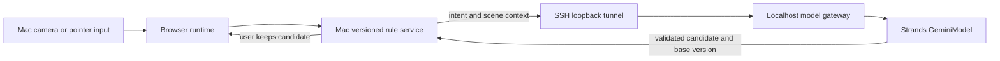

# Vertex and Strands model service

CAST uses the official Strands `GeminiModel` integration with Google Cloud Vertex AI. The model receives the designer's intent, current rules, and registered scene objects. Structured tools validate and return a candidate; the local versioned service performs installation.

## Local run

Set Application Default Credentials and select Vertex explicitly:

```bash
export CAST_PROVIDER=vertex
export CAST_MODEL_ID=gemini-2.5-flash
uvicorn cast.app:app --host 127.0.0.1 --port 8765
```

Credentials are never stored in the repository. Bedrock remains optional and is enabled explicitly with `CAST_PROVIDER=bedrock CAST_USE_BEDROCK=1`.

## Mac app with the VPS gateway

Run the model gateway on the VPS with the Vertex variables above. In the Mac checkout, run:

```bash
CAST_AGENT_URL=http://127.0.0.1:18765 ./scripts/start-mac.sh
```

The SSH loopback tunnel carries intent, rules, and scene context only. Camera frames stay local to the Mac. The gateway has no filesystem, installation, or camera access. If the remote model fails, the Mac reports the error and leaves installed rules unchanged; manual authoring remains available.



Do not bind the gateway to a public interface. Keep the loopback tunnel alive while using the Mac app.

## Evidence and limits

- Real model calls and behavioral checks are retained under `records/vertex-*.json`.
- Synthetic signals validate runtime behavior; they are not camera evidence.
- API probes validate the service boundary; they are not unattended product acceptance.
- The gateway uses a persistent request budget: ten requests per UTC day by default, at most three attempts per intent, 1024 output tokens per attempt, and a 30 KB input limit. The journal is stored outside the repository.
